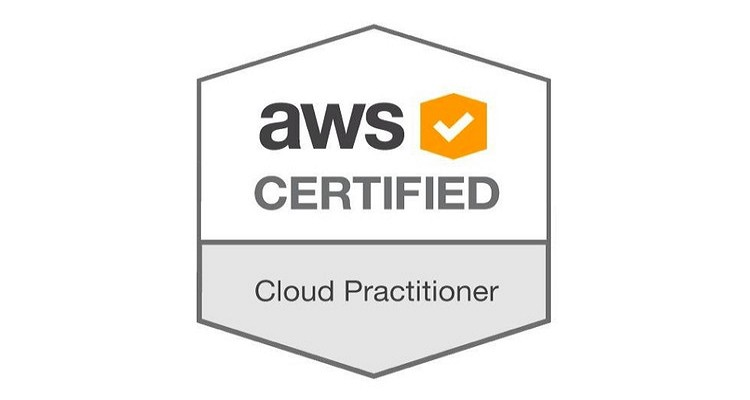

# AWS Cloud Practitioner Study Notes (CLF-C02)

- This will help you for quick revision before exam.
- If you are studying for AWS Cloud Practitioner certifications or you already have them but want to have digital notes of what you studied, here it is and you can come back as many times as you need. I share the notes I used to study and pass my exam.

## Buy This AWS Cloud Practitioner Study Notes And Practice Exams PDF

**[Sample PDF](./images/AWS-Cloud-Practitioner-Study-Notes-Sample.pdf)** &nbsp; &nbsp; &nbsp;
**[Buy Study Notes PDF](https://www.buymeacoffee.com/kananinirav/e/151079)** &nbsp; &nbsp; &nbsp;
**[Buy Practice Exams PDF](https://www.buymeacoffee.com/kananinirav/e/174069)**

Purchase a PDF on Kindle and adjust your region settings for the most favorable price based on your location: **[Kindle Edition](https://a.co/d/bvPmN94) (For kindle unlimited users)**

Purchase a PDF on **Leanpub**: [AWS Cloud Practitioner Study Notes (CLF-C02) PDF](https://leanpub.com/aws-cloud-practitioner-study-notes)

Each Section contains a number of units. **Below Table Link** containing information about each sections in detail.

## Table of contents

- [Mind Map for outlining essential topics](https://kananinirav.com/mind-map-aws-ccp.html)
- [Study Guide](./study-guide.md)
- [Cloud Computing](./sections/cloud_computing.md)
  - What is Cloud Computing?, AWS Global Infrastructure, Shared Responsibility Model
- [IAM: Identity Access & Management](./sections/iam.md)
  - What Is IAM?, Multi Factor Authentication - MFA, MFA devices options in AWS, How can users access AWS ?, What’s the AWS CLI?, What’s the AWS SDK?
- [EC2: Virtual Machines](./sections/ec2.md)
  - What is Amazon EC2?, Introduction to Security Groups, Classic Ports to know, EC2 Instance Launch Types, Which purchasing option is right for me?, Shared Responsibility Model for EC2
- [EC2 Instance Storage](./sections/ec2_storage.md)
  - EBS Volumes, EFS: Elastic File System, EFS Infrequent Access (EFS-IA), Amazon FSx – Overview, EC2 Instance Store, Shared Responsibility Model for EC2 Storage
- [Elastic Load Balancing & Auto Scaling Groups](./sections/elb_asg.md)
  - Scalability & High Availability, Vertical Scalability, Horizontal Scalability, High Availability, High Availability & Scalability For EC2, Scalability vs Elasticity (vs Agility), What is load balancing?, What’s an Auto Scaling Group?
- [Amazon S3](./sections/s3.md)
  - S3 Use cases, Amazon S3 Overview - Buckets, Amazon S3 Overview - Objects, S3 Websites, S3 Storage Classes, S3 Object Lock & Glacier Vault Lock, Shared Responsibility Model for S3, AWS Snow Family, What is Edge Computing?, Snow Family - Edge Computing, AWS OpsHub, Hybrid Cloud for Storage, AWS Storage Gateway
- [Databases & Analytics](./sections/databases.md)
  - Databases Intro, Relational Databases, NoSQL Databases, Databases & Shared Responsibility on AWS, AWS RDS Overview, Amazon Aurora, Amazon ElastiCache Overview, DynamoDB, Redshift Overview, Amazon EMR, Amazon Athena, Amazon QuickSight, DocumentDB, Amazon Neptune, Amazon QLDB
- [Other Compute Section](./sections/other_compute.md)
  - What is Docker?, ECS, Fargate, ECR, What’s serverless?, Why AWS Lambda ?, Amazon API Gateway, AWS Batch, Batch vs Lambda, Amazon Lightsail, Lambda Summary
- [Deploying and Managing Infrastructure at Scale](sections/deploying.md)
  - What is CloudFormation?, AWS Cloud Development Kit (CDK), Developer problems on AWS, Typical architecture: Web App 3-tier, AWS Elastic Beanstalk Overview, AWS CodeDeploy, AWS CodeCommit, AWS CodeBuild, AWS CodePipeline, AWS CodeArtifact, AWS CodeStar, AWS Cloud9, AWS Systems Manager (SSM), AWS OpsWorks
- [Global Infrastructure](sections/global_infrastructure.md)
  - Why make a global application?, Amazon Route 53 Overview, Route 53 Routing Policies, AWS CloudFront, AWS Global Accelerator, AWS Outposts, AWS WaveLength, AWS Local Zones
- [Cloud Integration](sections/cloud_integration.md)
  - Amazon SQS - Simple Queue Service, Amazon Kinesis, Amazon SNS, Amazon MQ
- [Cloud Monitoring](./sections/cloud_monitoring.md)
  - Amazon CloudWatch, AWS CloudTrail, AWS X-Ray, Amazon CodeGuru, AWS Status - Service Health Dashboard, AWS Personal Health Dashboard
- [VPC](./sections/vpc.md)
  - VPC & Subnets Primer, Internet Gateway & NAT Gateways, Network ACL & Security Groups, VPC Flow Logs, VPC Peering, VPC Endpoints, Site to Site VPN & Direct Connect, Transit Gateway
- [Security & Compliance](sections/security_compliance.md)
  - AWS Shared Responsibility Model, DDOS Protection on AWS, AWS Shield, AWS WAF - Web Application Firewall, AWS KMS (Key Management Service), CloudHSM, AWS Certificate Manager (ACM), AWS Secrets Manager, AWS Artifact (not really a service), Amazon GuardDuty, Amazon Inspector, AWS Config, Amazon Macie, AWS Security Hub, Amazon Detective, AWS Abuse, Root user privileges, IAM Access Analyzer
- [Machine Learning](sections/machine_learning.md)
  - Amazon Rekognition, Amazon Transcribe, Amazon Polly, Amazon Translate, Amazon Lex & Connect, Amazon Comprehend, Amazon SageMaker, Amazon Forecast, Amazon Kendra, Amazon Personalize, Amazon Textract
- [Account Management, Billing & Support](sections/account_management_billing_support.md)
  - AWS Organizations, Multi Account Strategies, Service Control Policies (SCP), AWS Organization - Consolidated Billing, AWS Control Tower, AWS Resource Access Manager (AWS RAM), AWS Service Catalog, Pricing Models in AWS, Compute Pricing, Storage Pricing, Database Pricing - RDS, Content Delivery - CloudFront, Networking Costs in AWS per GB - Simplified
- [Advanced Identity](sections/advanced_identity.md)
  - AWS STS (SecurityToken Service), Amazon Cognito (simplified), What is Microsoft Active Directory (AD)?, AWS IAM Identity Center
- [Other AWS Services](sections/other_aws_services.md)
  - Amazon WorkSpaces, Amazon AppStream 2.0, Amazon Sumerian, AWS IoT Core, Amazon Elastic Transcoder, AWS AppSync, AWS Amplify, AWS Device Farm, AWS Backup, AWS Elastic Disaster Recovery (DRS), AWS DataSync, AWS Application Discovery Service, AWS Application Migration Service (MGN), AWS Migration Evaluator, AWS Migration Hub, AWS Fault Injection Simulator (FIS), AWS Step Functions, AWS Ground Station, AWS Pinpoint
- [AWS Architecting & Ecosystem](sections/architecting_and_ecosystem.md)
  - Well Architected Framework General Guiding Principles, AWS Cloud Best Practices - Design Principles, Well Architected Framework 6 Pillars, AWS Well-Architected Tool, AWS Right Sizing, AWS Ecosystem - Free resources, AWS Marketplace

## Practice Exams ( dumps )

- **[Practice Exam List](https://kananinirav.com/practice-exam/exams.html)**

## Other AWS And Azure Certification Notes

- [Microsoft Azure Fundamentals (AZ-900)](https://certification.kananinirav.com/az-900-microsoft-azure-fundamentals/)
- [Useful Cheat Sheet For Developers](https://certification.kananinirav.com/cheat-sheets/)

### If you find the content of this website interesting and helpful, use the “Buy me a Coffee” link below to buy me a coffee

## Star History

