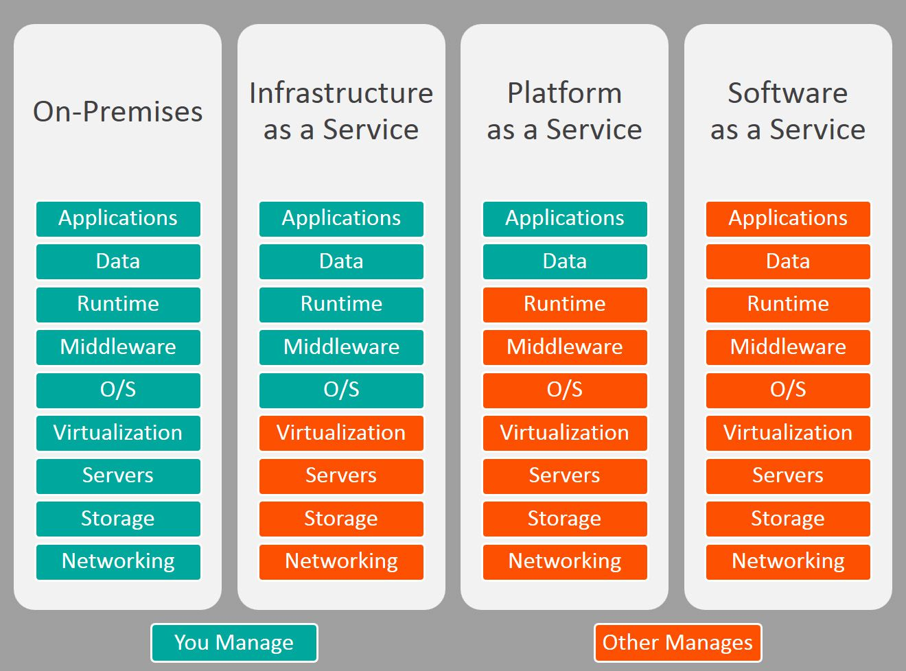

# Cloud Computing

- [Cloud Computing](#cloud-computing)
  - [What is Cloud Computing?](#what-is-cloud-computing)
    - [The Deployment Models of the Cloud](#the-deployment-models-of-the-cloud)
    - [The Five Characteristics of Cloud Computing](#the-five-characteristics-of-cloud-computing)
    - [Six Advantages of Cloud Computing](#six-advantages-of-cloud-computing)
    - [Problems solved by the Cloud](#problems-solved-by-the-cloud)
    - [Types of Cloud Computing](#types-of-cloud-computing)
    - [Example of Cloud Computing Types](#example-of-cloud-computing-types)
    - [Pricing of the Cloud – Quick Overview](#pricing-of-the-cloud--quick-overview)
    - [AWS Cloud Use Cases](#aws-cloud-use-cases)
  - [AWS Global Infrastructure](#aws-global-infrastructure)
    - [AWS Regions](#aws-regions)
    - [How to choose an AWS Region?](#how-to-choose-an-aws-region)
    - [AWS Availability Zones](#aws-availability-zones)
    - [AWS Points of Presence (Edge Locations)](#aws-points-of-presence-edge-locations)
  - [Tour of the AWS Console](#tour-of-the-aws-console)
  - [Shared Responsibility Model](#shared-responsibility-model)

## What is Cloud Computing?

- Cloud computing is the on-demand delivery of compute power, database storage, applications, and other IT resources
- Through a cloud services platform with pay-as-you-go pricing
- You can provision exactly the right type and size of computing resources you need
- You can access as many resources as you need, almost instantly
- Simple way to access servers, storage, databases and a set of application services
- Amazon Web Services owns and maintains the network-connected hardware required for these application services, while you provision and use what you need via a web application.

### The Deployment Models of the Cloud

| **Private Cloud:**                                                       | **Public Cloud:**                                                                                      | **Hybrid Cloud:**                                                       |
| ------------------------------------------------------------------------ | ------------------------------------------------------------------------------------------------------ | ----------------------------------------------------------------------- |
| Cloud services used by a single organization, not exposed to the public. | Cloud resources owned and operated by a thirdparty cloud service provider delivered over the Internet. | Keep some servers on premises and extend some capabilities to the Cloud |
| Complete control                                                         | Six Advantages of Cloud Computing                                                                      | Control over sensitive assets in your private infrastructure            |
| Security for sensitive applications                                      |                                                                                                        | Flexibility and costeffectiveness of the public cloud                   |
| Meet specific business needs                                             |                                                                                                        |

### The Five Characteristics of Cloud Computing

- **On-demand self service:**
  - Users can provision resources and use them without human interaction from the service provider
- **Broad network access:**
  - Resources available over the network, and can be accessed by diverse client platforms
- **Multi-tenancy and resource pooling:**
  - Multiple customers can share the same infrastructure and applications with security and privacy
  - Multiple customers are serviced from the same physical resources
- **Rapid elasticity and scalability:**
  - Automatically and quickly acquire and dispose resources when needed
  - Quickly and easily scale based on demand
- **Measured service:**
  - Usage is measured, users pay correctly for what they have used

### Six Advantages of Cloud Computing

- **Trade capital expense (CAPEX) for operational expense (OPEX)**
  - Pay On-Demand: don’t own hardware
  - Reduced Total Cost of Ownership (TCO) & Operational Expense (OPEX)
- **Benefit from massive economies of scale**
  - Prices are reduced as AWS is more efficient due to large scale
- **Stop guessing capacity**
  - Scale based on actual measured usage
- **Increase speed and agility**
- **Stop spending money running and maintaining data centers**
- **Go global in minutes:** leverage the AWS global infrastructure

### Problems solved by the Cloud

- **Flexibility:** change resource types when needed
- **Cost-Effectiveness:** pay as you go, for what you use
- **Scalability:** accommodate larger loads by making hardware stronger or adding additional nodes
- **Elasticity:** ability to scale out and scale-in when needed
- **High-availability and fault-tolerance:** build across data centers
- **Agility:** rapidly develop, test and launch software applications

### Types of Cloud Computing

- **Infrastructure as a Service (IaaS)**
  - Provide building blocks for cloud IT
  - Provides networking, computers, data storage space
  - Highest level of flexibility
  - Easy parallel with traditional on-premises IT
- **Platform as a Service (PaaS)**
  - Removes the need for your organization to manage the underlying infrastructure
  - Focus on the deployment and management of your applications
- **Software as a Service (SaaS)**
  - Completed product that is run and managed by the service provider

### Example of Cloud Computing Types

- **Infrastructure as a Service:**
  - Amazon EC2 (on AWS)
  - GCP, Azure, Rackspace, Digital Ocean, Linode
- Platform as a Service:
  - Elastic Beanstalk (on AWS)
  - Heroku, Google App Engine (GCP), Windows Azure (Microsoft)
- Software as a Service:
  - Many AWS services (ex: Rekognition for Machine Learning)
  - Google Apps (Gmail), Dropbox, Zoom

### Pricing of the Cloud – Quick Overview

- AWS has 3 pricing fundamentals, following the pay-as-you-go pricing model
- **Compute:**
  - Pay for compute time
- **Storage:**
  - Pay for data stored in the Cloud
- **Data transfer OUT of the Cloud:**
  - Data transfer IN is free
- Solves the expensive issue of traditional IT

### AWS Cloud Use Cases

- AWS enables you to build sophisticated, scalable applications
- Applicable to a diverse set of industries
- Use cases include
  - Enterprise IT, Backup & Storage, Big Data analytics
  - Website hosting, Mobile & Social Apps
  - Gaming

## AWS Global Infrastructure

- AWS Regions
- AWS Availability Zones
- AWS Data Centers
- AWS Edge Locations / Points of Presence
- <https://infrastructure.aws/>

### AWS Regions

- AWS has Regions all around the world
- Names can be us-east-1, eu-west-3…
- A region is a **cluster of data centers**
- **Most AWS services are region-scoped**

### How to choose an AWS Region?

If you need to launch a new application, where should you do it?

- **Compliance with data governance and legal requirements:** data never leaves a region without your explicit permission
- **Proximity to customers:** reduced latency
- **Available services within a Region:** new services and new features aren’t available in every Region
- **Pricing:** pricing varies region to region and is transparent in the service pricing page

### AWS Availability Zones

- Each region has many availability zones (usually 3, min is 2, max is 6). Example:
  - ap-southeast-2a
  - ap-southeast-2b
  - ap-southeast-2c
- Each availability zone (AZ) is one or more discrete data centers with redundant power, networking, and connectivity
- They’re separate from each other, so that they’re isolated from disasters
- They’re connected with high bandwidth, ultra-low latency networking

### AWS Points of Presence (Edge Locations)

- Amazon has 216 Points of Presence (205 Edge Locations & 11 Regional Caches) in 84 cities across 42 countries
- Content is delivered to end users with lower latency

## Tour of the AWS Console

- **AWS has Global Services:**
  - Identity and Access Management (IAM)
  - Route 53 (DNS service)
  - CloudFront (Content Delivery Network)
  - WAF (Web Application Firewall)
- **Most AWS services are Region-scoped:**
  - Amazon EC2 (Infrastructure as a Service)
  - Elastic Beanstalk (Platform as a Service)
  - Lambda (Function as a Service)
  - Rekognition (Software as a Service)
- **Region Table:** <https://aws.amazon.com/about-aws/global-infrastructure/regional-product-services>

## Shared Responsibility Model

- CUSTOMER = RESPONSIBILITY FOR THE SECURITY **IN** THE CLOUD
- AWS = RESPONSIBILITY FOR THE SECURITY **OF** THE CLOUD

* * *

[ Index](../README.md)&nbsp; &nbsp; &nbsp; &nbsp; &nbsp; &nbsp;[IAM: Identity Access & Management ](./iam.md)
