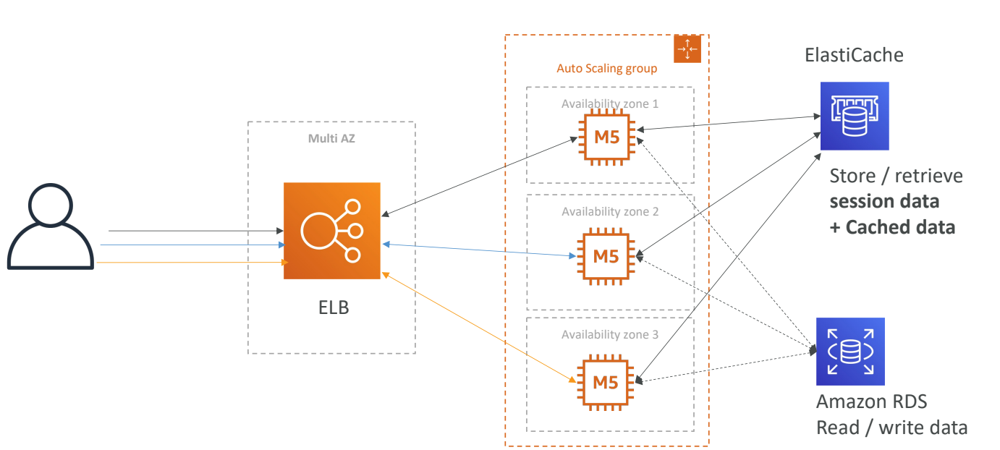
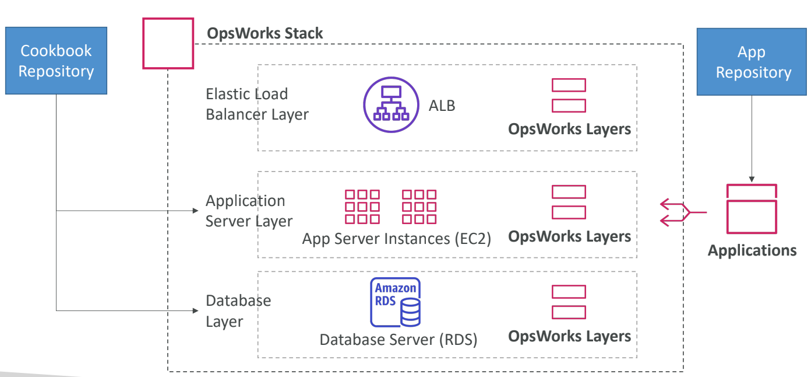

# Deploying and Managing Infrastructure at Scale

- [Deploying and Managing Infrastructure at Scale](#deploying-and-managing-infrastructure-at-scale)
  - [What is CloudFormation?](#what-is-cloudformation)
    - [Benefits of AWS CloudFormation](#benefits-of-aws-cloudformation)
    - [CloudFormation Stack Designer](#cloudformation-stack-designer)
  - [AWS Cloud Development Kit (CDK)](#aws-cloud-development-kit-cdk)
    - [Example of AWS CDK (Python)](#example-of-aws-cdk-python)
  - [Developer problems on AWS](#developer-problems-on-aws)
  - [Typical architecture: Web App 3-tier](#typical-architecture-web-app-3-tier)
  - [AWS Elastic Beanstalk Overview](#aws-elastic-beanstalk-overview)
    - [Elastic Beanstalk vs CloudFormation](#elastic-beanstalk-vs-cloudformation)
    - [Elastic Beanstalk - Health Monitoring](#elastic-beanstalk---health-monitoring)
  - [AWS CodeDeploy](#aws-codedeploy)
  - [AWS CodeCommit](#aws-codecommit)
  - [AWS CodeBuild](#aws-codebuild)
  - [AWS CodePipeline](#aws-codepipeline)
  - [AWS CodeArtifact](#aws-codeartifact)
  - [AWS CodeStar](#aws-codestar)
  - [AWS Cloud9](#aws-cloud9)
  - [AWS Systems Manager (SSM)](#aws-systems-manager-ssm)
    - [How Systems Manager works](#how-systems-manager-works)
    - [Systems Manager - SSM Session Manager](#systems-manager---ssm-session-manager)
  - [AWS OpsWorks](#aws-opsworks)
    - [OpsWorks Architecture](#opsworks-architecture)
  - [Deployment - Summary](#deployment---summary)
  - [Developer Services - Summary](#developer-services---summary)

## What is CloudFormation?

- CloudFormation is a declarative way of outlining your AWS Infrastructure, for any resources (most of them are supported).
- For example, within a CloudFormation template, you say:
  - I want a security group
  - I want two EC2 instances using this security group
  - I want an S3 bucket
  - I want a load balancer (ELB) in front of these machines
- Then CloudFormation creates those for you, in the right order, with the exact configuration that you specify

### Benefits of AWS CloudFormation

- Infrastructure as code
  - No resources are manually created, which is excellent for control
  - Changes to the infrastructure are reviewed through code
- Cost
  - Each resources within the stack is tagged with an identifier so you can easily see how much a stack costs you
  - You can estimate the costs of your resources using the CloudFormation template
  - Savings strategy: In Dev, you could automation deletion of templates at 5 PM and recreated at 8 AM, safely
- Productivity
  - Ability to destroy and re-create an infrastructure on the cloud on the fly
  - Automated generation of Diagram for your templates!
  - Declarative programming (no need to figure out ordering and orchestration)
- Don’t re-invent the wheel
  - Leverage existing templates on the web!
  - Leverage the documentation
- Supports (almost) all AWS resources:
  - Everything we’ll see in this course is supported
  - You can use “custom resources” for resources that are not supported

### CloudFormation Stack Designer

- Example: WordPress CloudFormation Stack
- We can see all the resources
- We can see the relations between the components

## AWS Cloud Development Kit (CDK)

- Define your cloud infrastructure using a familiar language:
  - JavaScript/TypeScript, Python, Java, and .NET
- The code is “compiled” into a CloudFormation template (JSON/YAML)
- You can therefore deploy infrastructure and application runtime code together
  - Great for Lambda functions
  - Great for Docker containers in ECS / EKS

### Example of AWS CDK (Python)

To use AWS CDK, you need to install the CDK CLI and initialize a new CDK project. Once you have set up your project, you can start defining your cloud infrastructure using the programming language of your choice. Then, you can deploy the infrastructure to your AWS account using the CDK CLI.

In below example, we define an AWS CDK stack that creates an S3 bucket with versioning enabled. To run this code, you'll need to have the AWS CDK for Python (`aws-cdk-lib`) installed in your Python environment. You can install it using pip:

```python
pip install aws-cdk-lib
```

Once you have the dependencies installed, you can execute this Python script, and it will create the S3 bucket in your AWS account based on the code defined in the `MyS3BucketStack` class.

```python
from aws_cdk import core
from aws_cdk import aws_s3 as s3

class MyS3BucketStack(core.Stack):
    def __init__(self, scope: core.Construct, id: str, **kwargs) -> None:
        super().__init__(scope, id, **kwargs)

        # Define an S3 bucket
        s3.Bucket(
            self,
            'MyS3Bucket',
            versioned=True,
            removal_policy=core.RemovalPolicy.DESTROY
        )

# App entry point
app = core.App()
MyS3BucketStack(app, 'MyS3BucketStack')
app.synth()
```

## Developer problems on AWS

- Managing infrastructure
- Deploying Code
- Configuring all the databases, load balancers, etc
- Scaling concerns
- Most web apps have the same architecture (ALB + ASG)
- All the developers want is for their code to run!
- Possibly, consistently across different applications and environments

## Typical architecture: Web App 3-tier



## AWS Elastic Beanstalk Overview

- Elastic Beanstalk is a developer centric view of deploying an application on AWS
- It uses all the component’s we’ve seen before: EC2, ASG, ELB, RDS, etc…
- But it’s all in one view that’s easy to make sense of!
- We still have full control over the configuration
- Beanstalk = Platform as a Service (PaaS)
- Beanstalk is free but you pay for the underlying instances
- Managed service
  - Instance configuration / OS is handled by Beanstalk
  - Deployment strategy is configurable but performed by Elastic Beanstalk
  - Capacity provisioning
  - Load balancing & auto-scaling
- Application health-monitoring & responsiveness
- Just the application code is the responsibility of the developer
- Three architecture models:
  - Single Instance deployment: good for dev
  - LB + ASG: great for production or pre-production web applications
  - ASG only: great for non-web apps in production (workers, etc..)

- Support for many platforms:
  - Go
  - Java SE
  - Java with Tomcat
  - .NET on Windows Server with IIS
  - Node.js
  - PHP
  - Python
  - Ruby
  - Packer Builder
  - Single Container Docker
  - Multi-Container Docker
  - Preconfigured Docker
- If not supported, you can write your custom platform.

### Elastic Beanstalk vs CloudFormation

AWS Elastic Beanstalk uses AWS CloudFormation underneath for managing the infrastructure and resources required to run your application. Then, what's the difference between them?

| Parameters    | AWS CloudFormation                                     | AWS Elastic Beanstalk                            |
| ------------- | ------------------------------------------------------ | ------------------------------------------------ |
| Purpose       | Infrastructure as Code                                 | Platform as a Service                            |
| Deployment    | Define and manage AWS infrastructure                   | Simplified application deployment and scaling    |
| Control       | High control and flexibility over underlying resources | Simplified management of underlying resources    |
| Management    | Manages entire stack of resources                      | Abstracts infrastructure management              |
| Granularity   | Fine-grained control over individual                   | Limited configuration of underlying resources    |
| Configuration | Uses JSON or YAML templates                            | Prescriptive configuration and environment setup |
| Use Cases     | Complex architectures and multi-service                | Web application deployment and scaling           |

### Elastic Beanstalk - Health Monitoring

- Health agent pushes metrics to CloudWatch
- Checks for app health, publishes health events

## AWS CodeDeploy

- We want to deploy our application automatically
- Works with EC2 Instances
- Works with On-Premises Servers
- Hybrid service
- Servers / Instances must be provisioned and configured ahead of time with the CodeDeploy Agent

## AWS CodeCommit

- Before pushing the application code to servers, it needs to be stored somewhere
- Developers usually store code in a repository, using the Git technology
- A famous public offering is GitHub, AWS’ competing product is CodeCommit
- CodeCommit:
  - Source-control service that hosts Git-based repositories
  - Makes it easy to collaborate with others on code
  - The code changes are automatically versioned
- Benefits:
  - Fully managed
  - Scalable & highly available
  - Private, Secured, Integrated with AWS

## AWS CodeBuild

- Code building service in the cloud (name is obvious)
- Compiles source code, run tests, and produces packages that are ready to be deployed (by CodeDeploy for example)
- Benefits:
  - Fully managed, serverless
  - Continuously scalable & highly available
  - Secure
  - Pay-as-you-go pricing – only pay for the build time

## AWS CodePipeline

- Orchestrate the different steps to have the code automatically pushed to production
- Code => Build => Test => Provision => Deploy
- Basis for CICD (Continuous Integration & Continuous Delivery)
- Benefits:
  - Fully managed, compatible with CodeCommit, CodeBuild, CodeDeploy, Elastic Beanstalk, CloudFormation, GitHub, 3rd-party services (GitHub…) & custom plugins…
  - Fast delivery & rapid updates

- CodePipeline: orchestration layer
  - CodeCommit => CodeBuild => CodeDeploy => Elastic Beanstalk

## AWS CodeArtifact

- Software packages depend on each other to be built (also called code dependencies), and new ones are created
- Storing and retrieving these dependencies is called artifact management
- Traditionally you need to setup your own artifact management system
- CodeArtifact is a secure, scalable, and cost-effective artifact management for software development
- Works with common dependency management tools such as Maven, Gradle, npm, yarn, twine, pip, and NuGet
- Developers and CodeBuild can then retrieve dependencies straight from CodeArtifact

## AWS CodeStar

- Unified UI to easily manage software development activities in one place
- “Quick way” to get started to correctly set-up CodeCommit, CodePipeline, CodeBuild, CodeDeploy, Elastic Beanstalk, EC2, etc…
- Can edit the code ”in-the-cloud” using AWS Cloud9

## AWS Cloud9

- AWS Cloud9 is a cloud IDE (Integrated Development Environment) for writing, running and debugging code
- “Classic” IDE (like IntelliJ, Visual Studio Code…) are downloaded on a computer before being used
- A cloud IDE can be used within a web browser, meaning you can work on your projects from your office, home, or anywhere with internet with no setup necessary
- AWS Cloud9 also allows for code collaboration in real-time (pair programming)

## AWS Systems Manager (SSM)

- Helps you manage your EC2 and On-Premises systems at scale
- Another Hybrid AWS service
- Get operational insights about the state of your infrastructure
- Suite of 10+ products
- Most important features are:
  - Patching automation for enhanced compliance
  - Run commands across an entire fleet of servers
  - Store parameter configuration with the SSM Parameter Store
- Works for both Windows and Linux OS

### How Systems Manager works

- We need to install the SSM agent onto the systems we control
- Installed by default on Amazon Linux AMI & some Ubuntu AMI
- If an instance can’t be controlled with SSM, it’s probably an issue with the SSM agent!
- Thanks to the SSM agent, we can run commands, patch & configure our servers

### Systems Manager - SSM Session Manager

- Allows you to start a secure shell on your EC2 and on-premises servers
- No SSH access, bastion hosts, or SSH keys needed
- No port 22 needed (better security)
- Supports Linux, macOS, and Windows
- Send session log data to S3 or CloudWatch Logs

## AWS OpsWorks

- Chef & Puppet help you perform server configuration automatically, or repetitive actions
- They work great with EC2 & On-Premises VM
- AWS OpsWorks = Managed Chef & Puppet
- It’s an alternative to AWS SSM
- Only provision standard AWS resources:
  - EC2 Instances, Databases, Load Balancers, EBS volumes…
- **Chef or Puppet needed => AWS OpsWorks**

### OpsWorks Architecture



## Deployment - Summary

- CloudFormation: (AWS only)
  - Infrastructure as Code, works with almost all of AWS resources
  - Repeat across Regions & Accounts
- Beanstalk: (AWS only)
  - Platform as a Service (PaaS), limited to certain programming languages or Docker
  - Deploy code consistently with a known architecture: ex, ALB + EC2 + RDS
- CodeDeploy (hybrid): deploy & upgrade any application onto servers
- Systems Manager (hybrid): patch, configure and run commands at scale
- OpsWorks (hybrid): managed Chef and Puppet in AWS

## Developer Services - Summary

- CodeCommit: Store code in private git repository (version controlled)
- CodeBuild: Build & test code in AWS
- CodeDeploy: Deploy code onto servers
- CodePipeline: Orchestration of pipeline (from code to build to deploy)
- CodeArtifact: Store software packages / dependencies on AWS
- CodeStar: Unified view for allowing developers to do CICD and code
- Cloud9: Cloud IDE (Integrated Development Environment) with collab
- AWS CDK: Define your cloud infrastructure using a programming language

* * *

[ Other Compute Section](./other_compute.md)&nbsp; &nbsp; &nbsp; &nbsp; &nbsp; &nbsp;[ List](../README.md)&nbsp; &nbsp; &nbsp; &nbsp; &nbsp; &nbsp;[Global Infrastructure ](./global_infrastructure.md)
