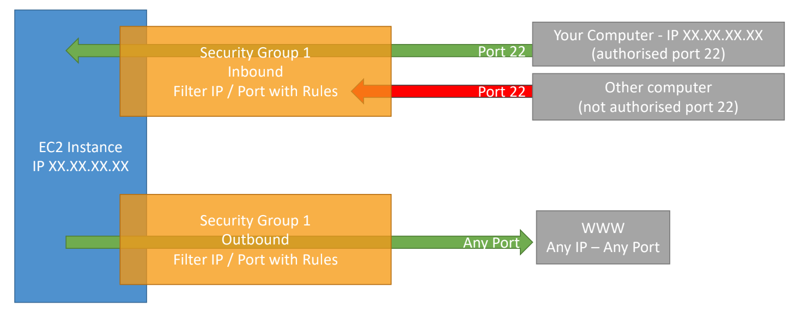

# EC2: Virtual Machines

- [EC2: Virtual Machines](#ec2-virtual-machines)
  - [What is Amazon EC2?](#what-is-amazon-ec2)
    - [EC2 sizing \& configuration options](#ec2-sizing--configuration-options)
    - [EC2 User Data](#ec2-user-data)
    - [EC2 Instance Types - Overview](#ec2-instance-types---overview)
      - [General Purpose](#general-purpose)
      - [Compute Optimized](#compute-optimized)
      - [Memory Optimized](#memory-optimized)
      - [Storage Optimized](#storage-optimized)
    - [EC2 Instance Types: example](#ec2-instance-types-example)
  - [Introduction to Security Groups](#introduction-to-security-groups)
    - [Deeper Dive](#deeper-dive)
    - [Security Groups Diagram](#security-groups-diagram)
    - [Good to know](#good-to-know)
  - [Classic Ports to know](#classic-ports-to-know)
  - [EC2 Instance Launch Types](#ec2-instance-launch-types)
    - [On Demand Instance](#on-demand-instance)
    - [Reserved Instances](#reserved-instances)
    - [Savings Plans](#savings-plans)
    - [Spot Instances](#spot-instances)
    - [Dedicated Hosts](#dedicated-hosts)
    - [Dedicated Instances](#dedicated-instances)
    - [Capacity Reservations](#capacity-reservations)
  - [Which purchasing option is right for me?](#which-purchasing-option-is-right-for-me)
  - [Price Comparison Example – m4.large – us-east-1](#price-comparison-example--m4large--us-east-1)
  - [Shared Responsibility Model for EC2](#shared-responsibility-model-for-ec2)
  - [EC2 Section – Summary](#ec2-section--summary)

## What is Amazon EC2?

Amazon Elastic Compute Cloud (Amazon EC2) provides scalable computing capacity in the Amazon Web Services (AWS) Cloud.

- EC2 is one of the most popular of AWS’ offering
- EC2 = Elastic Compute Cloud = Infrastructure as a Service
- It mainly consists in the capability of :
  - Renting virtual machines (EC2)
  - Storing data on virtual drives (EBS)
  - Distributing load across machines (ELB)
  - Scaling the services using an auto-scaling group (ASG)
- Knowing EC2 is fundamental to understand how the Cloud works

### EC2 sizing & configuration options

- Operating System (OS): Linux, Windows or Mac OS
- How much compute power & cores (CPU)
- How much random-access memory (RAM)
- How much storage space:
  - Network-attached (EBS & EFS)
  - hardware (EC2 Instance Store)
- Network card: speed of the card, Public IP address
- Firewall rules: **security group**
- Bootstrap script (configure at first launch): EC2 User Data

### EC2 User Data

- It is possible to bootstrap our instances using an **EC2 User data** script.
- **bootstrapping** means launching commands when a machine starts
- That script is **only run once** at the instance **first start**
- EC2 user data is used to automate boot tasks such as:
  - Installing updates
  - Installing software
  - Downloading common files from the internet
  - Anything you can think of
- The EC2 User Data Script runs with the root user

### EC2 Instance Types - Overview

- You can use different types of EC2 instances that are optimised for different use cases (<https://aws.amazon.com/ec2/instance-types/>)
  - [General Purpose](#general-purpose)
  - [Compute Optimized](#compute-optimized)
  - [Memory Optimized](#memory-optimized)
  - [Storage Optimized](#storage-optimized)
  - Accelerated Computing

- AWS has the following naming convention: m5.2xlarge
- m: instance class
- 5: generation (AWS improves them over time)
- 2xlarge: size within the instance class

#### General Purpose

- Great for a diversity of workloads such as web servers or code repositories
- Balance between:
  - Compute
  - Memory
  - Networking

#### Compute Optimized

- Great for compute-intensive tasks that require high performance processors:
  - Batch processing workloads
  - Media transcoding
  - High performance web servers
  - High performance computing (HPC)
  - Scientific modeling & machine learning
  - Dedicated gaming servers

#### Memory Optimized

- Fast performance for workloads that process large data sets in memory
- Use cases:
  - High performance, relational/non-relational databases
  - Distributed web scale cache stores
  - In-memory databases optimized for BI (business intelligence)
  - Applications performing real-time processing of big unstructured data

#### Storage Optimized

- Great for storage-intensive tasks that require high, sequential read and write access to large data sets on local storage
- Use cases:
  - High frequency online transaction processing (OLTP) systems
  - Relational & NoSQL databases
  - Cache for in-memory databases (for example, Redis)
  - Data warehousing applications
  - Distributed file systems

### EC2 Instance Types: example

| Instance    | vCPU | Mem (GiB) | Storage          | Network Performance | EBS Bandwidth (Mbps) |
| ----------- | ---- | --------- | ---------------- | ------------------- | -------------------- |
| t2.micro    | 1    | 1         | EBS-Only         | Low to Moderate     |
| t2.xlarge   | 4    | 16        | EBS-Only         | Moderate            |
| c5d.4xlarge | 16   | 32        | 1 x 400 NVMe SSD | Up to 10 Gbps       | 4,750                |
| r5.16xlarge | 64   | 512       | EBS Only         | 20 Gbps             | 13,600               |
| m5.8xlarge  | 32   | 128       | EBS Only         | 10 Gbps             | 6,800                |

t2.micro is part of the AWS free tier (up to 750 hours per month)

## Introduction to Security Groups

- Security Groups are the fundamental of network security in AWS
- They control how traffic is allowed into or out of our EC2 Instances.
- Security groups only contain allow rules
- Security groups rules can reference by IP or by security group

### Deeper Dive

- Security groups are acting as a “firewall” on EC2 instances
- They regulate:
  - Access to Ports
  - Authorised IP ranges – IPv4 and IPv6
  - Control of inbound network (from other to the instance)
  - Control of outbound network (from the instance to other)

### Security Groups Diagram

### Good to know

- Can be attached to multiple instances
- Locked down to a region / VPC combination
- Does live “outside” the EC2 – if traffic is blocked the EC2 instance won’t see it
- It’s good to maintain one separate security group for SSH access
- If your application is not accessible (time out), then it’s a security group issue
- If your application gives a “connection refused“ error, then it’s an application error or it’s not launched
- All inbound traffic is **blocked** by default
- All outbound traffic is **authorized** by default

## Classic Ports to know

- 22 = SSH (Secure Shell) - log into a Linux instance
- 21 = FTP (File Transfer Protocol) – upload files into a file share
- 22 = SFTP (Secure File Transfer Protocol) – upload files using SSH
- 80 = HTTP – access unsecured websites
- 443 = HTTPS – access secured websites
- 3389 = RDP (Remote Desktop Protocol) – log into a Windows instance

## EC2 Instance Launch Types

- [**On Demand Instances**](#on-demand-instance): short workload, predictable pricing
- [**Reserved**](#reserved-instances): (1 & 3 years)
  - **Reserved Instances**: long workloads
  - **Convertible Reserved Instances**: long workloads with flexible instances
- [**Savings Plans**](#savings-plans) (1 & 3 years): commitment to an amount of usage, long workload
- [**Spot Instances**](#spot-instances): short workloads, for cheap, can lose instances
- [**Dedicated Instances**](#dedicated-instances): no other customers will share your hardware
- [**Dedicated Hosts**](#dedicated-hosts): book an entire physical server, control instance placement
- [**Capacity Reservations**](#capacity-reservations): reserve capacity in a specific AZ for any duration

### On Demand Instance

- Pay for what you use:
  - Linux or Windows - billing per second, after the first minute
  - All other operating systems - billing per hour
- Has the highest cost but no upfront payment
- No long-term commitment
- Recommended for **short-term** and **un-interrupted workloads**, where you can't predict how the application will behave

### Reserved Instances

- Up to 72% discount compared to On-demand
- You reserve a specific instance attributes (Instance Type, Region, Tenancy, OS)
- Reservation Period – 1 year (+discount) or 3 years (+++discount)
- Payment Options – No Upfront (+), Partial Upfront (++), All Upfront (+++)
- Reserved Instance’s Scope – Regional or Zonal (reserve capacity in an AZ)
- Recommended for steady-state usage applications (think database)
- You can buy and sell in the Reserved Instance Marketplace

- Convertible Reserved Instance
  - Can change the EC2 instance type, instance family, OS, scope and tenancy
  - Up to 66% discount

### Savings Plans

- Get a discount based on long-term usage (up to 72% - same as RIs)
- Commit to a certain type of usage ($10/hour for 1 or 3 years)
- Usage beyond EC2 Savings Plans is billed at the On-Demand price

- Locked to a specific instance family & AWS region (e.g., M5 in us-east-1)
- Flexible across:
  - Instance Size (e.g., m5.xlarge, m5.2xlarge)
  - OS (e.g., Linux, Windows)
  - Tenancy (Host, Dedicated, Default)

### Spot Instances

- Can get a discount of up to 90% compared to On-demand
- Instances that you can “lose” at any point of time if your max price is less than the current spot price
- The MOST cost-efficient instances in AWS
- Useful for workloads that are resilient to failure
  - Batch jobs
  - Data analysis
  - Image processing
  - Any distributed workloads
  - Workloads with a flexible start and end time
- Not suitable for critical jobs or databases

### Dedicated Hosts

- A physical server with EC2 instance capacity fully dedicated to your use
- Allows you to address compliance requirements and use your existing server- bound software licenses (per-socket, per-core, pe—VM software licenses)
- Purchasing Options:
  - On-demand – pay per second for active Dedicated Host
  - Reserved - 1 or 3 years (No Upfront, Partial Upfront, All Upfront)
- The most expensive option
- Useful for software that have complicated licensing model (BYOL – Bring Your Own License)
- Or for companies that have strong regulatory or compliance needs

### Dedicated Instances

- Instances run on hardware that’s dedicated to you
- May share hardware with other instances in same account
- No control over instance placement (can move hardware after Stop / Start)

### Capacity Reservations

- Reserve On-Demand instances capacity in a specific AZ for any duration
- You always have access to EC2 capacity when you need it
- No time commitment (create/cancel anytime), no billing discounts
- Combine with Regional Reserved Instances and Savings Plans to benefit from billing discounts
- You’re charged at On-Demand rate whether you run instances or not
- Suitable for short-term, uninterrupted workloads that needs to be in a specific AZ

## Which purchasing option is right for me?

- On demand: coming and staying in resort whenever we like, we pay the full price
- Reserved: like planning ahead and if we plan to stay for a long time, we may get a good discount.
- Savings Plans: pay a certain amount per hour for certain period and stay in any room type (e.g., King, Suite, Sea View, …)
- Spot instances: the hotel allows people to bid for the empty rooms and the highest bidder keeps the rooms. You can get kicked out at any time
- Dedicated Hosts: We book an entire building of the resort
- Capacity Reservations: you book a room for a period with full price even you don’t stay in it

## Price Comparison Example – m4.large – us-east-1

| Price Type                             | Price (per hour)                           |
| -------------------------------------- | ------------------------------------------ |
| On-Demand                              | $0.10                                      |
| Spot Instance (Spot Price)             | $0.038 - $0.039 (up to 61% off)            |
| Reserved Instance (1 year)             | $0.062 (No Upfront) - $0.058 (All Upfront) |
| Reserved Instance (3 years)            | $0.043 (No Upfront) - $0.037 (All Upfront) |
| EC2 Savings Plan (1 year)              | $0.062 (No Upfront) - $0.058 (All Upfront) |
| Reserved Convertible Instance (1 year) | $0.071 (No Upfront) - $0.066 (All Upfront) |
| Dedicated Host                         | On-Demand Price                            |
| Dedicated Host Reservation             | Up to 70% off                              |
| Capacity Reservations                  | On-Demand Price                            |

## Shared Responsibility Model for EC2

| AWS                                      | USER                                                                                   |
| ---------------------------------------- | -------------------------------------------------------------------------------------- |
| Infrastructure (global network security) | Security Groups rules                                                                  |
| Isolation on physical hosts              | Operating-system patches and updates                                                   |
| Replacing faulty hardware                | Software and utilities installed on the EC2 instance                                   |
| Compliance validation                    | IAM Roles assigned to EC2 & IAM user access management, Data security on your instance |

## EC2 Section – Summary

- EC2 Instance: AMI (OS) + Instance Size (CPU + RAM) + Storage + security groups + EC2 User Data
- Security Groups: Firewall attached to the EC2 instance
- EC2 User Data: Script launched at the first start of an instance
- SSH: start a terminal into our EC2 Instances (port 22)
- EC2 Instance Role: link to IAM roles
- Purchasing Options: On-Demand, Spot, Reserved (Standard + Convertible + Scheduled), Dedicated Host, Dedicated Instance

* * *

[ IAM: Identity Access & Management](./iam.md)&nbsp; &nbsp; &nbsp; &nbsp; &nbsp; &nbsp;[ List](../README.md)&nbsp; &nbsp; &nbsp; &nbsp; &nbsp; &nbsp;[EC2 Instance Storage ](./ec2_storage.md)
