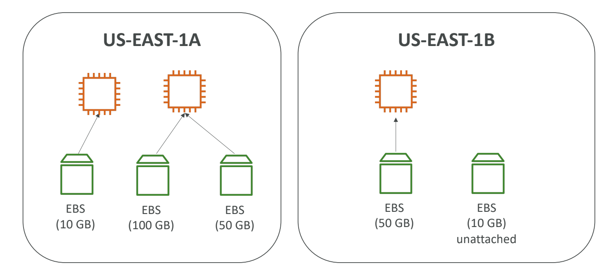
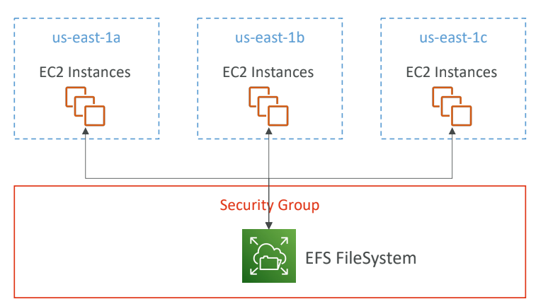

# EC2 Instance Storage

- [EC2 Instance Storage](#ec2-instance-storage)
  - [EBS Volumes](#ebs-volumes)
    - [What’s an EBS Volume?](#whats-an-ebs-volume)
    - [EBS Volume](#ebs-volume)
    - [EBS – Delete on Termination Attribute](#ebs--delete-on-termination-attribute)
    - [EBS Snapshots](#ebs-snapshots)
    - [EBS Snapshots Features](#ebs-snapshots-features)
  - [EFS: Elastic File System](#efs-elastic-file-system)
  - [EFS Infrequent Access (EFS-IA)](#efs-infrequent-access-efs-ia)
  - [Amazon FSx – Overview](#amazon-fsx--overview)
    - [Amazon FSx for Windows File Server](#amazon-fsx-for-windows-file-server)
    - [Amazon FSx for Lustre](#amazon-fsx-for-lustre)
  - [EC2 Instance Store](#ec2-instance-store)
  - [Shared Responsibility Model for EC2 Storage](#shared-responsibility-model-for-ec2-storage)
  - [AMI Overview](#ami-overview)
    - [AMI Process (from an EC2 instance)](#ami-process-from-an-ec2-instance)
  - [EC2 Image Builder](#ec2-image-builder)

## EBS Volumes

- AWS official Doc. <https://docs.aws.amazon.com/ebs/latest/userguide/ebs-volumes.html>

### What’s an EBS Volume?

- **Elastic Block Store (EBS)** is a network-attached storage for EC2 instances.
- Provides persistent, block-level storage volumes.
- Can be used for databases, file systems, or applications requiring consistent, low-latency performance.
- It allows your instances to persist data, even after their termination
- They can only be mounted to one instance at a time
- They are bound to a specific availability zone
- Free tier: 30 GB of free EBS storage of type General Purpose (SSD) or Magnetic per month

### EBS Volume

- Volumes are automatically replicated within an **Availability Zone** (AZ).
- Types include **General Purpose (gp3/gp2)**, **Provisioned IOPS (io1/io2)**, **Throughput Optimized (st1)**, and **Cold (sc1)**.
- Volumes can be attached to one EC2 instance at a time but can be detached and re-attached.
- Use case: preserve root volume when instance is terminated

### EBS – Delete on Termination Attribute

- Controls whether the EBS volume is automatically deleted when the associated EC2 instance is terminated.
  - By default, the root EBS volume is deleted (attribute enabled)
  - By default, any other attached EBS volume is not deleted (attribute disabled)
- Can be enabled or disabled based on the need to persist data after instance termination.

### EBS Snapshots

- Point-in-time backup of EBS volumes.
- Stored in Amazon S3 and can be used to restore or create new EBS volumes.

### EBS Snapshots Features

- **Incremental Backups**: Only the blocks changed since the last snapshot are saved.
- Can be used across different regions or accounts by copying snapshots.
- Snapshots can be automated via **Amazon Data Lifecycle Manager (DLM)**.
- EBS Snapshot Archive
  - Move a Snapshot to an ”archive tier” that is 75% cheaper
  - Takes within 24 to 72 hours for restoring the archive
- Recycle Bin for EBS Snapshots
  - Setup rules to retain deleted snapshots so you can recover them after an accidental deletion
  - Specify retention (from 1 day to 1 year)

## EFS: Elastic File System

- Fully managed **NFS (Network File System)** for EC2 instances that can be mounted on 100s of EC2.
- Can scale automatically as data grows.
- Accessible from multiple AZs, providing high availability and durability.

## EFS Infrequent Access (EFS-IA)

- Lower-cost storage class for data not accessed frequently.
- Up to 92% lower cost compared to EFS Standard
- Allows cost savings by automatically moving infrequently accessed files to **EFS-IA**.
- Provides the same high availability as standard EFS.
- Example: move files that are not accessed for 60 days to EFS-IA

## Amazon FSx – Overview

- Fully managed service providing file systems optimized for different workloads.
- Launch 3rd party high-performance file systems on AWS
- Fully managed service
  - FSx for Lustre
  - FSx for Windows File Server
  - FSx for NetApp ONTAP

### Amazon FSx for Windows File Server

- Provides fully managed file storage built on Windows Server.
- Supports **SMB protocol** & **Windows NTFS**
- Integration with **Active Directory**, and **Windows-based applications**.
- Can be accessed from AWS or your on-premise infrastructure

### Amazon FSx for Lustre

- High-performance file system optimized for compute-heavy workloads.
- Designed for applications needing fast storage
- Like machine learning, high-performance computing, or video processing.
- Scales up to 100s GB/s, millions of IOPS, sub-ms latencies

## EC2 Instance Store

- **Ephemeral storage** directly attached to the EC2 instance.
- EBS volumes are network drives with good but “limited” performance
- High I/O performance but non-persistent (data is lost when the instance stops or terminates).
- Ideal for temporary storage of data like caches, buffers, or temporary files.
- Good for buffer / cache / scratch data / temporary content
- Risk of data loss if hardware fails
- Backups and Replication are your responsibility

## Shared Responsibility Model for EC2 Storage

| **AWS Responsibilities**                                  | **User Responsibilities**                         |
| --------------------------------------------------------- | ------------------------------------------------- |
| Ensure durability and availability of EBS and EFS storage | Back up data via snapshots, EFS replication, etc. |
| Data replication within the AZ for EBS volumes            | Manage access and encryption of storage resources |
| Provide encryption capabilities (KMS integration)         | Apply encryption for sensitive data at rest       |
| Replacing faulty hardware                                 | Responsibility of any data on the drives          |

## AMI Overview

- **Amazon Machine Image (AMI)**: Template used to launch EC2 instances.
- An AMI contains an operating system, application server, and applications.
- AMI are a customization of an EC2 instance
  - You add your own software, configuration, operating system, monitoring…
  - Faster boot / configuration time because all your software is pre-packaged
- AMI are built for a specific region (and can be copied across regions)
- You can launch EC2 instances from:
  - A Public AMI: AWS provided
  - Your own AMI: you make and maintain them yourself
  - An AWS Marketplace AMI: an AMI someone else made (and potentially sells)

### AMI Process (from an EC2 instance)

1. Launch an EC2 instance.
2. Configure the instance with applications or settings.
3. Create an AMI from the running instance, which can be used to launch new EC2 instances with the same configuration.

## EC2 Image Builder

- Automates the process of creating and maintaining custom AMIs.
- Helps create compliant, secure, and up-to-date machine images.
- Allows integration with services like **AWS Systems Manager** for automation and lifecycle management.
- Can be run on a schedule (weekly, whenever packages are updated, etc…)
- Free service (only pay for the underlying resources)
