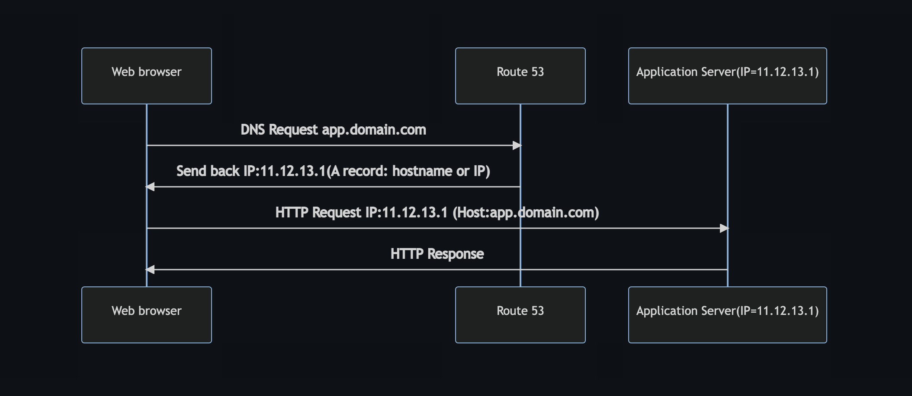

# Global Infrastructure

- [Global Infrastructure](#global-infrastructure)
  - [Why make a global application?](#why-make-a-global-application)
    - [Global AWS Infrastructure](#global-aws-infrastructure)
    - [Global Applications in AWS](#global-applications-in-aws)
  - [Amazon Route 53 Overview](#amazon-route-53-overview)
    - [Route 53 - Diagram for A Record](#route-53---diagram-for-a-record)
  - [Route 53 Routing Policies](#route-53-routing-policies)
    - [simple routing policy](#simple-routing-policy)
    - [weighted routing policy](#weighted-routing-policy)
    - [latency routing policy](#latency-routing-policy)
    - [failover routing policy](#failover-routing-policy)
  - [AWS CloudFront](#aws-cloudfront)
    - [CloudFront - Origins](#cloudfront---origins)
    - [CloudFront vs S3 Cross Region Replication](#cloudfront-vs-s3-cross-region-replication)
    - [S3 Transfer Acceleration](#s3-transfer-acceleration)
  - [AWS Global Accelerator](#aws-global-accelerator)
    - [AWS Global Accelerator vs CloudFront](#aws-global-accelerator-vs-cloudfront)
  - [AWS Outposts](#aws-outposts)
    - [AWS Outposts Benefits](#aws-outposts-benefits)
  - [AWS WaveLength](#aws-wavelength)
  - [AWS Local Zones](#aws-local-zones)
  - [Global Applications - Summary](#global-applications---summary)

## Why make a global application?

- A global application is an application deployed in **multiple geographies**
- On AWS: this could be **Regions** and / or **Edge Locations**
- **Decreased Latency**
  - Latency is the time it takes for a network packet to reach a server
  - It takes time for a packet from Asia to reach the US
  - Deploy your applications closer to your users to decrease latency, better experience
- **Disaster Recovery (DR)**
  - If an AWS region goes down (earthquake, storms, power shutdown, politics)…
  - You can fail-over to another region and have your application still working
  - A DR plan is important to increase the availability of your application
- **Attack protection**: distributed global infrastructure is harder to attack

### Global AWS Infrastructure

- Regions: For deploying applications and infrastructure
- Availability Zones: Made of multiple data centers
- Edge Locations (Points of Presence): for content delivery as close as possible to users
- More at: <https://infrastructure.aws/>
  
### Global Applications in AWS

- **Global DNS: Route 53**
  - Great to route users to the closest deployment with least latency
  - Great for disaster recovery strategies
- **Global Content Delivery Network (CDN): CloudFront**
  - Replicate part of your application to AWS Edge Locations – decrease latency
  - Cache common requests – improved user experience and decreased latency
- **S3 Transfer Acceleration**
  - Accelerate global uploads & downloads into Amazon S3
- **AWS Global Accelerator:**
  - Improve global application availability and performance using the AWS global network

## Amazon Route 53 Overview

- Route53 is a Managed DNS (Domain Name System)
- DNS is a collection of rules and records which helps clients understand how to reach a server through URLs.
- In AWS, the most common records are:
  - www.google.com => 12.34.56.78 == A record (IPv4)
  - www.google.com => 2001:0db8:85a3:0000:0000:8a2e:0370:7334 == AAAA IPv6
  - search.google.com => www.google.com == CNAME: hostname to hostname
  - example.com => AWS resource == Alias (ex: ELB, CloudFront, S3, RDS, etc…)

### Route 53 - Diagram for A Record



<!-- 
```mermaid
sequenceDiagram
    participant Web browser
    participant Route 53
    participant Application Server(IP=11.12.13.1)
    Web browser->>Route 53: DNS Request app.domain.com
    Route 53 ->> Web browser: Send back IP:11.12.13.1(A record: hostname or IP)
    Web browser->>Application Server(IP=11.12.13.1): HTTP Request IP:11.12.13.1 (Host:app.domain.com)
    Application Server(IP=11.12.13.1) ->> Web browser: HTTP Response
``` -->

## Route 53 Routing Policies

Need to know them at a high-level for the Cloud Practitioner Exam

- simple routing policy
- weighted routing policy
- latency routing policy
- failover routing policy

### simple routing policy

- Use for a single resource that performs a given function for your domain
- for example, a web server that serves content for the example.com website.
- You can use simple routing to create records in a private hosted zone

### weighted routing policy

- Use to route traffic to multiple resources in proportions that you specify.
- You can use weighted routing to create records in a private hosted zone.

### latency routing policy

- Use when you have resources in multiple AWS Regions and you want to route traffic to the region that provides the best latency.
- You can use latency routing to create records in a private hosted zone.

### failover routing policy

- Use when you want to configure active-passive failover.
- You can use failover routing to create records in a private hosted zone.

## AWS CloudFront

- Content Delivery Network (CDN)
- **Improves read performance, content is cached at the edge**
- Improves users experience
- 216 Point of Presence globally (edge locations)
- DDoS protection (because worldwide), integration with Shield, AWS Web Application Firewall
- Source: <https://aws.amazon.com/cloudfront/features/?nc=sn&loc=2>
  
### CloudFront - Origins

- S3 bucket
  - For distributing files and caching them at the edge
  - Enhanced security with CloudFront Origin Access Identity (OAI)
  - CloudFront can be used as an ingress (to upload files to S3)
- Custom Origin (HTTP)
  - Application Load Balancer
  - EC2 instance
  - S3 website (must first enable the bucket as a static S3 website)
  - Any HTTP backend you want

### CloudFront vs S3 Cross Region Replication

| CloudFront                                                     | S3 Cross Region Replication                                                            |
| -------------------------------------------------------------- | -------------------------------------------------------------------------------------- |
| Global Edge network                                            | Must be setup for each region you want replication to happen                           |
| Files are cached for a TTL (Time to Live) (maybe a day)        | Files are updated in near real-time, Read only                                         |
| **Great for static content that must be available everywhere** | **Great for dynamic content that needs to be available at low-latency in few regions** |

### S3 Transfer Acceleration

- Increase transfer speed by transferring file to an AWS edge location which will forward the data to the S3 bucket in the target region
- if we try to upload file to Australia S3 bucket it will take time using CloudFront we can rescue time.
- File in USA -> Edge Location(USA) -> S3 Bucket(Australia)
- Test the tool at: <https://s3-accelerate-speedtest.s3-accelerate.amazonaws.com/en/accelerate-speed-comparsion.html>

## AWS Global Accelerator

- Improve global application availability and performance using the AWS global network
- Leverage the AWS internal network to optimize the route to your application (60% improvement)
- 2 Anycast IP are created for your application and traffic is sent through Edge Locations
- The Edge locations send the traffic to your application
- Test the tool at: <https://speedtest.globalaccelerator.aws/#/>

### AWS Global Accelerator vs CloudFront

- They both use the AWS global network and its edge locations around the world
- Both services integrate with AWS Shield for DDoS protection.
- CloudFront – Content Delivery Network
  - Improves performance for your cacheable content (such as images and videos)
  - Content is served at the edge
- Global Accelerator
  - No caching, proxying packets at the edge to applications running in one or more AWS Regions.
  - Improves performance for a wide range of applications over TCP or UDP
  - Good for HTTP use cases that require static IP addresses
  - Good for HTTP use cases that required deterministic, fast regional failover

## AWS Outposts

- **Hybrid Cloud**: businesses that keep an on - premises infrastructure alongside a cloud infrastructure
- Therefore, two ways of dealing with IT systems: • One for the AWS cloud (using the AWS console, CLI, and AWS APIs)
- One for their on-premises infrastructure
- **AWS Outposts are “server racks”** that offers the same AWS infrastructure, services, APIs & tools to build your own applications on-premises just as in the cloud
- **AWS will setup and manage “Outposts Racks”** within your on-premises infrastructure and you can start leveraging AWS services on-premises
- You are responsible for the Outposts Rack physical security

### AWS Outposts Benefits

- Low-latency access to on-premises systems
- Local data processing
- Data residency
- Easier migration from on-premises to the cloud
- Fully managed service
- Some services that work on Outposts:
  - EC2
  - EBS
  - S3
  - EKS
  - ECS
  - RDS
  - EMR

## AWS WaveLength

- WaveLength Zones are infrastructure deployments embedded within the telecommunications providers’ datacenters at the edge of the 5G networks
- Brings AWS services to the edge of the 5G networks
- Example: EC2, EBS, VPC…
- Ultra-low latency applications through 5G networks
- Traffic doesn’t leave the Communication Service Provider’s (CSP) network
- High-bandwidth and secure connection to the parent AWS Region
- No additional charges or service agreements
- Use cases: Smart Cities, ML-assisted diagnostics, Connected Vehicles, Interactive Live Video Streams, AR/VR, Real-time Gaming
  
## AWS Local Zones

- Places AWS compute, storage, database, and other selected AWS services closer to end users to run latency-sensitive
applications
- Extend your VPC to more locations – “Extension of an AWS Region”
- Compatible with EC2, RDS, ECS, EBS, ElastiCache, Direct Connect …
- Example:
  - AWS Region: N. Virginia (us-east-1)
  - AWS Local Zones: Boston, Chicago, Dallas, Houston, Miami
  
## Global Applications - Summary

- Global DNS: Route 53
  - Great to route users to the closest deployment with least latency
  - Great for disaster recovery strategies
- Global Content Delivery Network (CDN): CloudFront
  - Replicate part of your application to AWS Edge Locations – decrease latency
  - Cache common requests – improved user experience and decreased latency
- S3 Transfer Acceleration
  - Accelerate global uploads & downloads into Amazon S3
- AWS Global Accelerator
  - Improve global application availability and performance using the AWS global network
- AWS Outposts
  - Deploy Outposts Racks in your own Data Centers to extend AWS services
- AWS WaveLength
  - Brings AWS services to the edge of the 5G networks
  - Ultra-low latency applications
- AWS Local Zones
  - Bring AWS resources (compute, database, storage, …) closer to your users
  - Good for latency-sensitive applications

* * *

[ Deploying and Managing Infrastructure at Scale](./deploying.md)&nbsp; &nbsp; &nbsp; &nbsp; &nbsp; &nbsp;[ List](../README.md)&nbsp; &nbsp; &nbsp; &nbsp; &nbsp; &nbsp;[Cloud Integration ](./cloud_integration.md)
