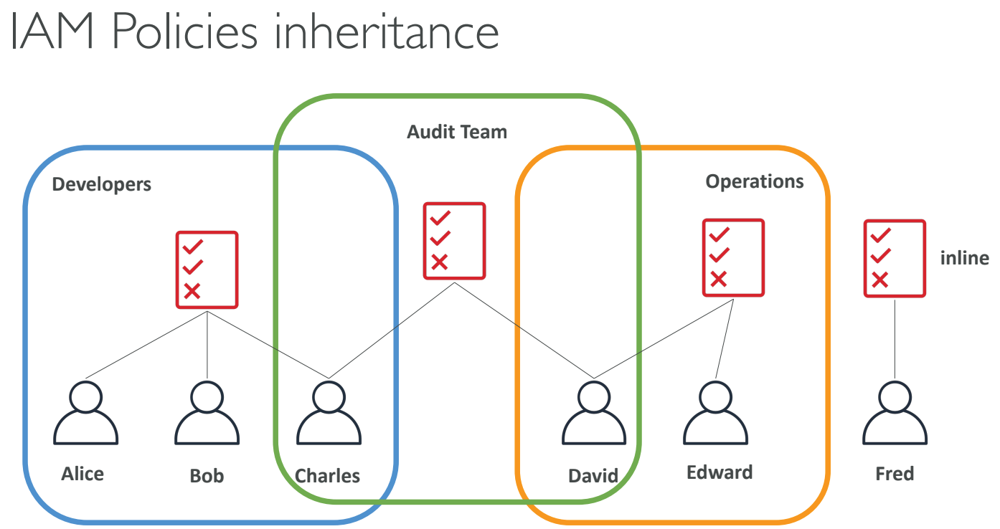

# IAM: Identity Access & Management (IAM)

- [IAM: Identity Access \& Management (IAM)](#iam-identity-access--management-iam)
  - [What Is IAM?](#what-is-iam)
    - [IAM: Users \& Groups](#iam-users--groups)
    - [IAM: Permissions](#iam-permissions)
    - [IAM Policies Inheritance](#iam-policies-inheritance)
    - [IAM Policies Structure](#iam-policies-structure)
      - [Example IAM Policy](#example-iam-policy)
    - [IAM – Password Policy](#iam--password-policy)
      - [Common Password Policy Settings:](#common-password-policy-settings)
    - [IAM Roles for Services](#iam-roles-for-services)
    - [IAM Security Tools](#iam-security-tools)
    - [IAM Guidelines \& Best Practices](#iam-guidelines--best-practices)
    - [Shared Responsibility Model for IAM](#shared-responsibility-model-for-iam)
  - [Multi-Factor Authentication (MFA)](#multi-factor-authentication-mfa)
    - [Benefits of MFA](#benefits-of-mfa)
  - [MFA Devices Options in AWS](#mfa-devices-options-in-aws)
  - [How Can Users Access AWS?](#how-can-users-access-aws)
  - [What’s the AWS CLI?](#whats-the-aws-cli)
    - [Key Features of AWS CLI:](#key-features-of-aws-cli)
    - [Example Commands:](#example-commands)
  - [What’s the AWS SDK?](#whats-the-aws-sdk)
    - [Key Features of AWS SDK:](#key-features-of-aws-sdk)
    - [Example Usage (Python boto3 SDK):](#example-usage-python-boto3-sdk)
  - [IAM Section – Summary](#iam-section--summary)

## What Is IAM?

- **Identity and Access Management (IAM)** is a web service for securely controlling access to AWS resources.
- Allows you to manage:
  - **Users**: Individual identities who interact with AWS services.
  - **Groups**: Collection of IAM users with similar access permissions.
  - **Roles**: Set of permissions to be assumed by AWS services or applications.

### IAM: Users & Groups

- **Users**: Represent individual identities that interact with AWS services. Users have unique credentials (username, password, access keys).
- **Groups**: Logical grouping of users to simplify permission management.
  - Permissions assigned to a group are automatically inherited by its users.
- Flexibility in User Management in IAM, users do not have to belong to a group, and a user can belong to multiple groups. This allows user to manage access permissions in a granular and efficient manner. For example, a user could belong to both the “QAs" group and the “Developers” group, inheriting permissions from both.

| **IAM Users**                                              | **IAM Groups**                                           |
|------------------------------------------------------------|----------------------------------------------------------|
| Unique identity for accessing AWS services.                | Logical grouping of users to apply common permissions.    |
| Each user has individual permissions based on policies.    | Adding/removing users from groups automatically changes their permissions. |

### IAM: Permissions

- **Permissions** are defined using policies.
- Policies specify what actions are allowed or denied on specific resources.
- Policies can be attached to:
  - **Users**
  - **Groups**
  - **Roles**

### IAM Policies Inheritance



- Policies are evaluated together for a user, including:
  - **Directly attached policies**.
  - **Group policies**.
  - **Policies attached to roles**.
- If multiple policies apply, IAM combines them to evaluate the final permission set.

| **Policy Type**                 | **Description**                                                                                  |
|---------------------------------|------------------------------------------------------------------------------------------------|
| **Inline Policies**             | Directly attached to a single user, group, or role.                                              |
| **Managed Policies**            | Reusable policies created and maintained by AWS (AWS-managed) or the customer (Customer-managed). |
| **Group Inherited Policies**     | Policies assigned to groups apply to all users in that group.                                    |

### IAM Policies Structure

- Policies are JSON documents that define permissions.
- Key elements of a policy:
  1. **Version**: Policy language version (e.g., `2012-10-17`).
  2. **Statement**: Contains one or more permissions (allow or deny).
  3. **Action**: Specifies which AWS service actions are allowed or denied.
  4. **Resource**: Specifies the AWS resources to which the actions apply.
  5. **Effect**: Either `Allow` or `Deny`.

#### Example IAM Policy

```json
{
  "Version": "2012-10-17",
  "Statement": [
    {
      "Effect": "Allow",
      "Action": "s3:ListBucket",
      "Resource": "arn:aws:s3:::example-bucket"
    }
  ]
}
```

### IAM – Password Policy

- AWS allows you to define a **password policy** for IAM users to ensure strong security standards.
- You can enforce specific rules to make sure passwords are complex and secure.

#### Common Password Policy Settings:

1. **Minimum password length**: Set a minimum number of characters (e.g., at least 8 characters).
2. **Require specific character types**:
   - Lowercase letters.
   - Uppercase letters.
   - Numbers.
   - Non-alphanumeric characters (special symbols like `!`, `@`, `#`).
3. **Prevent password reuse**: Enforce that new passwords cannot be the same as recently used passwords (e.g., prevent using the last 3 passwords).
4. **Password expiration**: Set the password to expire after a certain period (e.g., 90 days) to prompt users to change their passwords.
5. **Enable Multi-Factor Authentication (MFA)**: Enforce MFA for extra security, requiring both a password and a second authentication factor.

### IAM Roles for Services

- IAM roles are used to grant permissions to AWS services to perform actions on behalf of users or applications.
- Example use cases for IAM roles:
  1. An EC2 instance can assume a role to access S3 buckets without the need for storing long-term credentials.
  2. Lambda functions can use roles to interact with other AWS services without hardcoding access keys.

### IAM Security Tools

1. **IAM Credential Report**:
   - A report that provides details about all IAM users in the AWS account, including the status of their passwords and access keys.
   - Useful for auditing and reviewing user credentials.

2. **IAM Access Advisor**:
   - Shows service permissions granted to a user and indicates the last time those permissions were used.
   - Helps identify unnecessary permissions that can be revoked for least privilege.

3. **IAM Policy Simulator**:
   - A tool that lets you test and validate the impact of IAM policies before applying them to users, groups, or roles.
   - Helps to understand which actions are allowed or denied based on current policies.

### IAM Guidelines & Best Practices

1. **Follow the Principle of Least Privilege**:
   - Grant only the permissions required to perform a specific task.
   - Regularly review and adjust permissions as needed.

2. **Enable Multi-Factor Authentication (MFA)**:
   - Enforce MFA for privileged IAM users (e.g., admin accounts).
   - Adds an additional layer of security by requiring users to provide a code from an MFA device along with their password.

3. **Use IAM Roles Instead of IAM Users for Applications**:
   - Assign roles to AWS resources instead of using IAM user credentials in code or configuration files.
   - Prevents security issues that could arise from accidental exposure of long-term credentials.

4. **Rotate IAM Credentials Regularly**:
   - Regularly rotate IAM access keys and passwords.
   - Remove unused credentials to reduce risk.

5. **Use AWS Managed Policies for Common Use Cases**:
   - AWS provides a set of predefined managed policies that are regularly updated.
   - Managed policies are designed for common use cases and provide a good starting point for granting permissions.

### Shared Responsibility Model for IAM

- **AWS Responsibility**:
  - Protect the infrastructure that runs AWS services.
  - Provide IAM service availability.
  - Offer managed policies for common scenarios.

- **Customer Responsibility**:
  - Manage IAM users, groups, and roles.
  - Configure IAM policies correctly and apply the principle of least privilege.
  - Secure IAM credentials and enable MFA.
  - Regularly audit permissions using tools like IAM Credential Report and Access Advisor.

| **AWS Responsibility**                                    | **Customer Responsibility**                                                            |
|-----------------------------------------------------------|---------------------------------------------------------------------------------------|
| Protect physical data centers and global infrastructure.  | Manage and secure IAM user accounts and access keys.                                   |
| Maintain the availability of IAM service.                 | Implement strong password policies and enable MFA.                                     |
| Provide IAM managed policies for common scenarios.        | Ensure IAM permissions are correctly configured and follow the principle of least privilege. |

## Multi-Factor Authentication (MFA)

- **MFA** adds an extra layer of protection on top of a username and password.
- With MFA enabled, when a user signs in, they must provide:
  1. Their **password** (something they know).
  2. An **authentication code** from their MFA device (something they have).
- Even if a user’s password is compromised, MFA can prevent unauthorized access.

### Benefits of MFA

- Enhances account security by requiring a second form of authentication.
- Reduces the risk of credential compromise and unauthorized access.
- AWS recommends enabling MFA for all IAM users, especially for root accounts and privileged users.
- Main benefit of MFA: if a password is stolen or hacked, the account is not compromised

## MFA Devices Options in AWS

AWS supports several types of MFA devices:

| **MFA Device Type**                             | **Description**                                                                                                          |
|------------------------------------------------|--------------------------------------------------------------------------------------------------------------------------|
| **Virtual MFA Device**                          | Uses apps like Google Authenticator or Authy. Generates a time-based one-time password (TOTP) on a smartphone or tablet.  |
| **Hardware MFA Device**                         | Physical devices like Gemalto tokens that generate time-based codes.                                                     |
| **U2F Security Key**                            | USB devices supporting the Universal 2nd Factor (U2F) standard. Typically used for browser-based sign-ins.               |
| **AWS Multi-Factor Authentication (MFA)**       | AWS offers its own MFA solutions integrated with IAM to easily configure and manage MFA devices for users.               |

## How Can Users Access AWS?

AWS provides multiple ways for users to access resources:

| **Access Method**              | **Description**                                                                                                                                                 |
|--------------------------------|-----------------------------------------------------------------------------------------------------------------------------------------------------------------|
| **AWS Management Console**     | A web-based user interface for interacting with and managing AWS resources visually. Best for beginners and infrequent tasks.                                    |
| **AWS Command Line Interface (CLI)** | A unified tool to interact with AWS services using commands in your terminal. Suitable for automation and developers.                                          |
| **AWS Software Development Kits (SDKs)** | Language-specific APIs for programmatically accessing AWS services using programming languages like Python, JavaScript, Java, Ruby, etc.                        |
| **AWS CloudFormation**         | A service to define and provision AWS infrastructure using code (Infrastructure as Code – IaC). Allows creating stacks and automating deployment configurations.  |
| **AWS Mobile Console**         | Provides mobile access to manage AWS services on-the-go.                                                                                                         |

## What’s the AWS CLI?

- **AWS CLI (Command Line Interface)** is a unified tool to manage AWS services through your terminal or command prompt.
- It allows you to issue commands and automate tasks across multiple AWS services.
- Supports both Windows, macOS, and Linux.
- Direct access to the public APIs of AWS services

### Key Features of AWS CLI:

1. **Command automation**: Write scripts to automate frequent AWS tasks.
2. **Access to all services**: Interact with any AWS service and manage resources from the command line.
3. **Profile management**: Manage multiple AWS accounts using different named profiles.
4. **JSON and YAML output**: Format CLI responses for better readability or integration with other tools.

### Example Commands:

```bash
# List all S3 buckets in your account
aws s3 ls

# Describe EC2 instances in a specific region
aws ec2 describe-instances --region us-west-2
```

## What’s the AWS SDK?

- AWS SDK (Software Development Kit) allows developers to interact with AWS services using various programming languages.
- Supports languages like Python (boto3), JavaScript (aws-sdk), Java, .NET, Ruby, PHP, and more.
- SDKs provide simplified APIs, making it easier to work with AWS services programmatically without dealing with low-level API calls.

### Key Features of AWS SDK:

- API abstraction: Higher-level abstractions simplify complex operations like S3 object uploads or DynamoDB queries.
- Cross-service integration: SDKs help integrate multiple AWS services together within applications.
- Authentication: Easily manage credentials and authenticate requests using IAM roles or user access keys.
- Retry logic: Handles transient network issues with built-in retry logic.

### Example Usage (Python boto3 SDK):

```Python
import boto3

# Create an S3 client
s3 = boto3.client('s3')

# List all S3 buckets
response = s3.list_buckets()
print('S3 Buckets:', [bucket['Name'] for bucket in response['Buckets']])
```

## IAM Section – Summary

- **Users**: Mapped to a physical user, has a username and password for AWS Management Console access.
- **Groups**: Contains users and allows applying common permissions to multiple users.
- **Policies**: JSON document that defines permissions for users, groups, or roles.
- **Roles**: Assign to AWS services (e.g., EC2, Lambda) for accessing other resources without credentials.
- **Permissions**: Allow or deny actions on AWS resources, defined using policies.
- **MFA**: Multi-Factor Authentication for an additional layer of security beyond username and password.
- **Password Policy**: Enforce password complexity, rotation, and reuse rules for IAM users.
- **AWS CLI**: Command-line tool to interact with AWS services and automate tasks.
- **AWS SDK**: Use programming languages (e.g., Python, JavaScript) to manage AWS services programmatically.
- **Access Keys**: Key pairs used to authenticate when accessing AWS using the CLI or SDK.
- **Audit Tools**: IAM Credential Report lists user credentials; Access Advisor shows service permissions usage.
