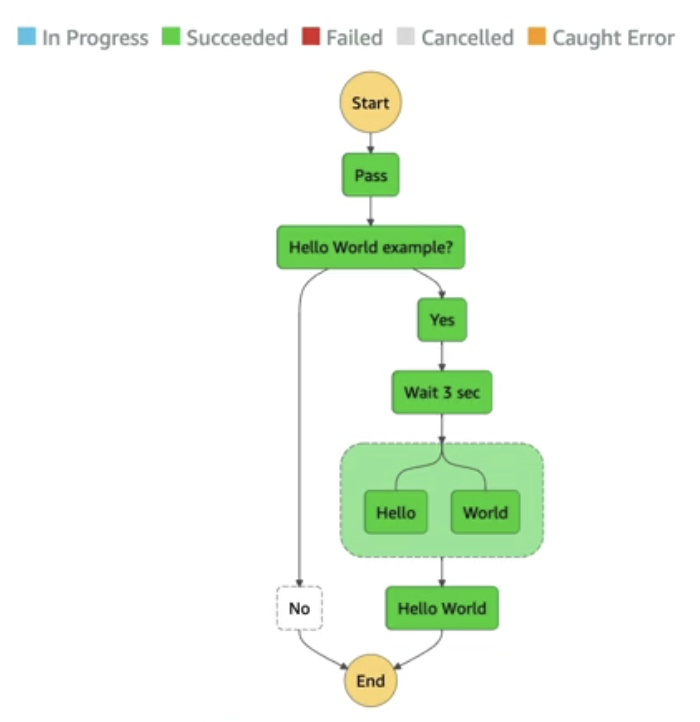

# Other AWS Services

- [Other AWS Services](#other-aws-services)
  - [Amazon WorkSpaces](#amazon-workspaces)
  - [Amazon AppStream 2.0](#amazon-appstream-20)
  - [Amazon Sumerian](#amazon-sumerian)
  - [AWS IoT Core](#aws-iot-core)
  - [Amazon Elastic Transcoder](#amazon-elastic-transcoder)
  - [AWS AppSync](#aws-appsync)
  - [AWS Amplify](#aws-amplify)
  - [AWS Device Farm](#aws-device-farm)
  - [AWS Backup](#aws-backup)
  - [AWS Elastic Disaster Recovery (DRS)](#aws-elastic-disaster-recovery-drs)
  - [AWS DataSync](#aws-datasync)
  - [AWS Application Discovery Service](#aws-application-discovery-service)
  - [AWS Application Migration Service (MGN)](#aws-application-migration-service-mgn)
  - [AWS Migration Evaluator](#aws-migration-evaluator)
  - [AWS Migration Hub](#aws-migration-hub)
  - [AWS Fault Injection Simulator (FIS)](#aws-fault-injection-simulator-fis)
  - [AWS Step Functions](#aws-step-functions)
  - [AWS Ground Station](#aws-ground-station)
  - [AWS Pinpoint](#aws-pinpoint)

## Amazon WorkSpaces

- Managed Desktop as a Service (DaaS) solution to provision Windows or Linux desktops
- Eliminates management of on-premise VDI (Virtual Desktop Infrastructure)
- Scalable to thousands of users quickly
- Secured data with integration to KMS
- Pay-as-you-go service with monthly or hourly rates

## Amazon AppStream 2.0

- Desktop Application Streaming Service
- Deliver applications to any computer without provisioning infrastructure
- Applications are delivered from within a web browser

| Amazon AppStream 2.0                                                       | WorkSpaces                                                       |
| -------------------------------------------------------------------------- | ---------------------------------------------------------------- |
| Stream a desktop application to web browsers (no need to connect to a VDI) | Fully managed VDI and desktop available                          |
| Works with any device (that has a web browser)                             | Users connect to the VDI and open native or WAM applications      |
| Configure an instance type per application type (CPU, RAM, GPU)            | Workspaces are on-demand or always on                            |

## Amazon Sumerian

- Create and run virtual reality (VR), augmented reality (AR), and 3D applications
- Quickly create 3D models with animations
- Ready-to-use templates and assets - no programming or 3D expertise required
- Accessible via web-browser URLs or on popular hardware for AR/VR
- Example: <https://docs.aws.amazon.com/sumerian/latest/userguide/gettingstartedshowcase.html>

## AWS IoT Core

- IoT stands for “Internet of Things” – the network of internet-connected devices that collect and transfer data
- Connect IoT devices to AWS Cloud serverlessly, securely, and scalably
- Applications can communicate with devices even when they aren’t connected
- Integrates with many AWS services (Lambda, S3, SageMaker, etc.)
- Build IoT applications that gather, process, analyze, and act on data

## Amazon Elastic Transcoder

- Convert media files stored in S3 into formats required by consumer playback devices (phones, etc.)
- Benefits:
  - Easy to use
  - Highly scalable – handles large volumes and sizes of media files
  - Cost-effective – duration-based pricing model
  - Fully managed & secure, pay for what you use

## AWS AppSync

- Store and sync data across mobile and web apps in real-time
- Uses GraphQL
- Automatically generates client code
- Integrates with DynamoDB / Lambda
- Real-time subscriptions
- Offline data synchronization (replaces Cognito Sync)
- Fine Grained Security
- AWS Amplify can leverage AWS AppSync in the background!

## AWS Amplify

- A set of tools and services for developing and deploying scalable full stack web and mobile applications
- Features:
  - Backend-as-a-Service (BaaS)
  - Frontend Libraries and UI Components
  - Authentication
  - Storage
  - API Management (REST, GraphQL)
  - Real-Time and Offline Capabilities through AWS AppSync
  - CI/CD
  - Command-Line Interface (CLI)
  - PubSub
  - Analytics
  - AI/ML Predictions
  - Monitoring
  - Source Code from AWS, GitHub, etc.

## AWS Device Farm

- Fully-managed service that tests web and mobile apps against desktop browsers, real mobile devices, and tablets
- Run tests concurrently on multiple devices to speed up execution
- Configure device settings (GPS, language, Wi-Fi, Bluetooth, etc.)

## AWS Backup

- Fully-managed service to centrally manage and automate backups across AWS services
- On-demand and scheduled backups
- Supports PITR (Point-in-time Recovery)
- Retention Periods, Lifecycle Management, Backup Policies, etc.
- Cross-Region Backup
- Cross-Account Backup (using AWS Organizations)

## AWS Elastic Disaster Recovery (DRS)

- Formerly known as “CloudEndure Disaster Recovery”
- Quickly and easily recover physical, virtual, and cloud-based servers into AWS
- Example: protect critical databases (Oracle, MySQL, SQL Server), enterprise apps (SAP), and protect data from ransomware attacks
- Continuous block-level replication for servers

## AWS DataSync

- Move large amounts of data from on-premises to AWS
- Synchronize to Amazon S3 (any storage classes including Glacier), Amazon EFS, Amazon FSx for Windows
- Schedule replication tasks hourly, daily, weekly
- Incremental replication after the first full load

## AWS Application Discovery Service

- Plan migration projects by gathering information about on-premises data centers
- Collect server utilization data and dependency mapping for migrations
- Agentless Discovery (AWS Agentless Discovery Connector):
  - VM inventory, configuration, and performance history (CPU, memory, disk usage)
- Agent-based Discovery (AWS Application Discovery Agent):
  - System configuration, performance, running processes, and network connections between systems
- Data can be viewed within AWS Migration Hub

## AWS Application Migration Service (MGN)

- The “AWS evolution” of CloudEndure Migration, replacing AWS Server Migration Service (SMS)
- Lift-and-shift (rehost) solution to simplify migrating applications to AWS
- Converts physical, virtual, and cloud-based servers to run natively on AWS
- Supports a wide range of platforms, Operating Systems, and databases
- Minimal downtime and reduced costs

## AWS Migration Evaluator

- Build a data-driven business case for migration to AWS
- Provides a clear baseline of current infrastructure
- Use Agentless Collector for broad-based discovery
- Take a snapshot of on-premises footprint, server dependencies, etc.
- Analyze current state, define target state, and develop a migration plan

## AWS Migration Hub

- Central location to collect servers and applications inventory data for the assessment, planning, and tracking of migrations to AWS
- Accelerate migration to AWS, automate lift-and-shift
- AWS Migration Hub Orchestrator provides pre-built templates for migrating enterprise apps (e.g., SAP, Microsoft SQL Server)
- Supports migration status updates from Application Migration Service (MGN) and Database Migration Service (DMS)

## AWS Fault Injection Simulator (FIS)

- Fully managed service for running fault injection experiments on AWS workloads
- Based on Chaos Engineering – stress an application by creating disruptive events (e.g., sudden increase in CPU or memory), observe system response, and implement improvements
- Uncover hidden bugs and performance bottlenecks
- Supports AWS services such as EC2, ECS, EKS, RDS
- Use pre-built templates for desired disruptions

## AWS Step Functions

- Build serverless visual workflows to orchestrate Lambda functions
- Features: sequence, parallel, conditions, timeouts, error handling, etc.
- Integrate with EC2, ECS, on-premises servers, API Gateway, SQS queues, etc.
- Implement human approval feature
- Use cases: order fulfillment, data processing, web applications, any workflow

## AWS Ground Station

- Fully managed service for controlling satellite communications, processing data, and scaling satellite operations
- Global network of satellite ground stations near AWS regions
- Download satellite data to your AWS VPC within seconds
- Send satellite data to S3 or EC2 instance
- Use cases: weather forecasting, surface imaging, communications, video broadcasts

## AWS Pinpoint

- Scalable 2-way (outbound/inbound) marketing communications service
- Supports email, SMS, push, voice, and in-app messaging
- Segment and personalize messages with the right content for customers
- Receive replies
- Scale to billions of messages per day
- Use cases: run campaigns by sending marketing, bulk, transactional SMS messages
- Comparison with Amazon SNS or Amazon SES:
  - SNS & SES: manage each message's audience, content, and delivery schedule
  - Amazon Pinpoint: create message templates, delivery schedules, targeted segments, and full campaigns

* * *

[ Advanced Identity](./advanced_identity.md)&nbsp; &nbsp; &nbsp; &nbsp; &nbsp; &nbsp;[<img align="center" src="../images/list[...]
