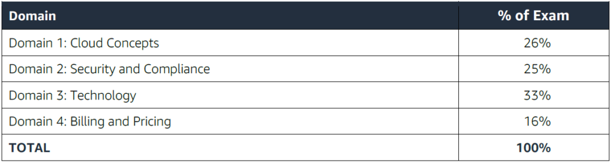

# Study Guide

- [Study Guide](#study-guide)
  - [Target candidate description](#target-candidate-description)
    - [Recommended AWS knowledge](#recommended-aws-knowledge)
    - [What is considered out of scope for the target candidate?](#what-is-considered-out-of-scope-for-the-target-candidate)
  - [Exam content](#exam-content)
    - [Response types](#response-types)
    - [Unscored content](#unscored-content)
  - [Exam results](#exam-results)
  - [Domain 1: Cloud Concepts](#domain-1-cloud-concepts)
    - [Define the AWS Cloud and its value proposition](#define-the-aws-cloud-and-its-value-proposition)
    - [Identify aspects of AWS Cloud economics](#identify-aspects-of-aws-cloud-economics)
    - [Explain the different cloud architecture design principles](#explain-the-different-cloud-architecture-design-principles)
  - [Domain 2: Security and Compliance](#domain-2-security-and-compliance)
    - [Define the AWS shared responsibility model](#define-the-aws-shared-responsibility-model)
    - [Define AWS Cloud security and compliance concepts](#define-aws-cloud-security-and-compliance-concepts)
    - [Identify AWS access management capabilities](#identify-aws-access-management-capabilities)
    - [Identify resources for security support](#identify-resources-for-security-support)
  - [Domain 3: Technology](#domain-3-technology)
    - [Define methods of deploying and operating in the AWS Cloud](#define-methods-of-deploying-and-operating-in-the-aws-cloud)
    - [Define the AWS global infrastructure](#define-the-aws-global-infrastructure)
    - [Identify the core AWS services](#identify-the-core-aws-services)
    - [Identify resources for technology support](#identify-resources-for-technology-support)
  - [Domain 4: Billing and Pricing](#domain-4-billing-and-pricing)
    - [Compare and contrast the various pricing models for AWS (for example, On-Demand Instances, Reserved Instances, and Spot Instance pricing)](#compare-and-contrast-the-various-pricing-models-for-aws-for-example-on-demand-instances-reserved-instances-and-spot-instance-pricing)
    - [Recognize the various account structures in relation to AWS billing and pricing](#recognize-the-various-account-structures-in-relation-to-aws-billing-and-pricing)
    - [Identify resources available for billing support](#identify-resources-available-for-billing-support)

The AWS Certified Cloud Practitioner (CLF-C01) exam is intended for individuals who can effectively demonstrate an **overall knowledge of the AWS Cloud** independent of a specific job role. **The exam validates a candidate’s ability to complete the following tasks:**

- Explain the value of the AWS Cloud
- Understand and explain the AWS shared responsibility model
- Understand security best practices
- Understand AWS Cloud costs, economics, and billing practices
- Describe and position the core AWS services, including compute, network, databases, and storage
- Identify AWS services for common use cases

## Target candidate description

**The target candidate should have 6 months, or the equivalent, of active engagement with the AWS Cloud**, with exposure to AWS Cloud design, implementation, and/or operations. Candidates will demonstrate an understanding of well-designed AWS Cloud solutions.

### Recommended AWS knowledge

**The target candidate should have the following knowledge:**

- AWS Cloud concepts
- Security and compliance within the AWS Cloud
- Understanding of the core AWS services
- Understanding of the economics of the AWS Cloud

### What is considered out of scope for the target candidate?

The following is a non-exhaustive list of related job tasks that the target candidate is not expected to be able to perform.**These items are considered out of scope for the exam:**

- Coding
- Designing cloud architecture
- Troubleshooting
- Implementation
- Migration
- Load and performance testing
- Business applications (for example, Amazon Alexa, Amazon Chime, Amazon WorkMail)

## Exam content

### Response types

There are two types of questions on the exam:

- **Multiple choice:** Has one correct response and three incorrect responses.
- **Multiple response:** Has two or more correct responses out of five or more response options.

**Unanswered questions are scored as incorrect; there is no penalty for guessing. The exam includes 50 questions that will affect your score.**

### Unscored content

**The exam includes 15 unscored questions that do not affect your score.** AWS collects information about candidate performance on these unscored questions to evaluate these questions for future use as scored questions. These unscored questions are not identified on the exam.

## Exam results

**The AWS Certified Cloud Practitioner exam is a pass or fail exam.** The exam is scored against a minimum standard established by AWS professionals who follow certification industry best practices and guidelines.

**Your results for the exam are reported as a scaled score of 100–1,000. The minimum passing score is 700.** Your score shows how you performed on the exam as a whole and whether or not you passed. Scaled scoring models help equate scores across multiple exam forms that might have slightly different difficulty levels.

Your score report may contain a table of classifications of your performance at each section level. This information is intended to provide general feedback about your exam performance. The exam uses a compensatory scoring model, which means that **you do not need to achieve a passing score in each section.** You need to pass only the overall exam.

**Each section of the exam has a specific weighting, so some sections have more questions than others.** The table contains general information that highlights your strengths and weaknesses. Use caution when interpreting section-level feedback. Passing candidates will not receive this additional information.

## Domain 1: Cloud Concepts

### Define the AWS Cloud and its value proposition

- Define the benefits of the AWS cloud including:
  - Security Reliability
  - High Availability
  - Elasticity
  - Agility
  - Pay-as-you go pricing
  - Scalability
  - Global Reach
  - Economy of scale
- Explain how the AWS cloud allows users to focus on business value:
  - Shifting technical resources to revenue-generating activities as opposed to managing infrastructure

### Identify aspects of AWS Cloud economics

- Define items that would be part of a Total Cost of Ownership proposal:
  - Understand the role of operational expenses (OpEx)
  - Understand the role of capital expenses (CapEx)
  - Understand labor costs associated with on-premises operations
  - Understand the impact of software licensing costs when moving to the cloud
- Identify which operations will reduce costs by moving to the cloud:
- Right-sized infrastructure
- Benefits of automation
- Reduce compliance scope (for example, reporting)
- Managed services (for example, RDS, ECS, EKS, DynamoDB)

### Explain the different cloud architecture design principles

- Explain the design principles:
  - Design for failure
  - Decouple components versus monolithic architecture
  - Implement elasticity in the cloud versus on-premises
  - Think parallel

## Domain 2: Security and Compliance

### Define the AWS shared responsibility model

- Recognize the elements of the Shared Responsibility Model
- Describe the customer’s responsibly on AWS:
  - Describe how the customer’s responsibilities may shift depending on the service used (for example with RDS, Lambda, or EC2)
- Describe AWS responsibilities

### Define AWS Cloud security and compliance concepts

- Identify where to find AWS compliance information:
  - Locations of lists of recognized available compliance controls (for example, HIPPA, SOCs)
  - Recognize that compliance requirements vary among AWS services
- At a high level, describe how customers achieve compliance on AWS:
  - Identify different encryption options on AWS (for example, In transit, At rest)
- Describe who enables encryption on AWS for a given service
- Recognize there are services that will aid in auditing and reporting:
  - Recognize that logs exist for auditing and monitoring (do not have to understand the logs)
  - Define Amazon CloudWatch, AWS Config, and AWS CloudTrail
- Explain the concept of least privileged access

### Identify AWS access management capabilities

- Understand the purpose of User and Identity Management
  - Access keys and password policies (rotation, complexity)
  - Multi-Factor Authentication (MFA)
  - AWS Identity and Access Management (IAM)
    - Groups/users
    - Roles
    - Policies, managed policies compared to custom policies
  - Tasks that require use of root accounts
  - Protection of root accounts

### Identify resources for security support

- Recognize there are different network security capabilities
  - Native AWS services (for example, security groups, Network ACLs, AWS WAF)
  - 3rd party security products from the AWS Marketplace
- Recognize there is documentation and where to find it (for example, best practices, whitepapers, official documents)
  - AWS Knowledge Center, Security Center, security forum, and security blogs
- Partner Systems Integrators
- Know that security checks are a component of AWS Trusted Advisor

## Domain 3: Technology

### Define methods of deploying and operating in the AWS Cloud

- Identify at a high level different ways of provisioning and operating in the AWS cloud:
  - Programmatic access, APIs, SDKs, AWS Management Console, CLI, Infrastructure as Code
- Identify different types of cloud deployment models:
  - All in with cloud/cloud native
  - Hybrid
  - On-premises
- Identify connectivity options
  - VPN
  - AWS Direct Connect
  - Public internet

### Define the AWS global infrastructure

- Describe the relationships among Regions, Availability Zones, and Edge Locations
- Describe how to achieve high availability through the use of multiple Availability Zones:
  - Recall that high availability is achieved by using multiple Availability Zones
  - Recognize that Availability Zones do not share single points of failure
- Describe when to consider the use of multiple AWS Regions:
  - Disaster recovery/business continuity
  - Low latency for end-users
  - Data sovereignty
- Describe at a high level the benefits of Edge Locations
  - Amazon CloudFront
  - AWS Global Accelerator

### Identify the core AWS services

- Describe the categories of services on AWS (compute, storage, network, database)
- Identify AWS compute services:
  - Recognize there are different compute families
  - Recognize the different services that provide compute (for example, AWS Lambda compared to Amazon Elastic Container Service (Amazon ECS), or Amazon EC2, etc.)
  - Recognize that elasticity is achieved through Auto Scaling
  - Identify the purpose of load balancers
- Identify different AWS storage services:
  - Describe Amazon S3
  - Describe Amazon Elastic Block Store (Amazon EBS)
  - Describe Amazon S3 Glacier
  - Describe AWS Snowball
  - Describe Amazon Elastic File System (Amazon EFS)
  - Describe AWS Storage Gateway
  - Identify AWS networking services
  - Identify VPC
  - Identify security groups
  - Identify the purpose of Amazon Route 53
  - Identify VPN, AWS Direct Connect
- Identify different AWS database services:
  - Install databases on Amazon EC2 compared to AWS managed databases
  - Identify Amazon RDS
  - Identify Amazon DynamoDB
  - Identify Amazon Redshift

### Identify resources for technology support

- Recognize there is documentation (best practices, whitepapers, AWS Knowledge Center, forums, blogs)
- Identify the various levels and scope of AWS support:
  - AWS Abuse
  - AWS support cases
  - Premium support
  - Technical Account Managers
- Recognize there is a partner network (marketplace, third-party) including Independent Software Vendors and System Integrators
- Identify sources of AWS technical assistance and knowledge including professional services, solution architects, training and certification, and the Amazon Partner Network
- Identify the benefits of using AWS Trusted Advisor

## Domain 4: Billing and Pricing

### Compare and contrast the various pricing models for AWS (for example, On-Demand Instances, Reserved Instances, and Spot Instance pricing)

- Identify scenarios/best fit for On-Demand Instance pricing
- Identify scenarios/best fit for Reserved-Instance pricing:
  - Describe Reserved-Instances flexibility
  - Describe Reserved-Instances behavior in AWS Organizations
- Identify scenarios/best fit for Spot Instance pricing

### Recognize the various account structures in relation to AWS billing and pricing

- Recognize that consolidated billing is a feature of AWS Organizations
- Identify how multiple accounts aid in allocating costs across departments

### Identify resources available for billing support

- Identify ways to get billing support and information:
  - Cost Explorer, AWS Cost and Usage Report, Amazon QuickSight, third-party partners, and AWS Marketplace tools
  - Open a billing support case
  - The role of the Concierge for AWS Enterprise Support Plan customers
- Identify where to find pricing information on AWS services:
  - AWS Simple Monthly Calculator
  - AWS Services product pages
  - AWS Pricing API
- Recognize that alarms/alerts exist
- Identify how tags are used in cost allocation

**AWS Official Guide Reference Link:**

- [AWS Official Website](https://aws.amazon.com/certification/certified-cloud-practitioner/)
- [AWS Reference PDF](https://d1.awsstatic.com/training-and-certification/docs-cloud-practitioner/AWS-Certified-Cloud-Practitioner_Exam-Guide.pdf)
